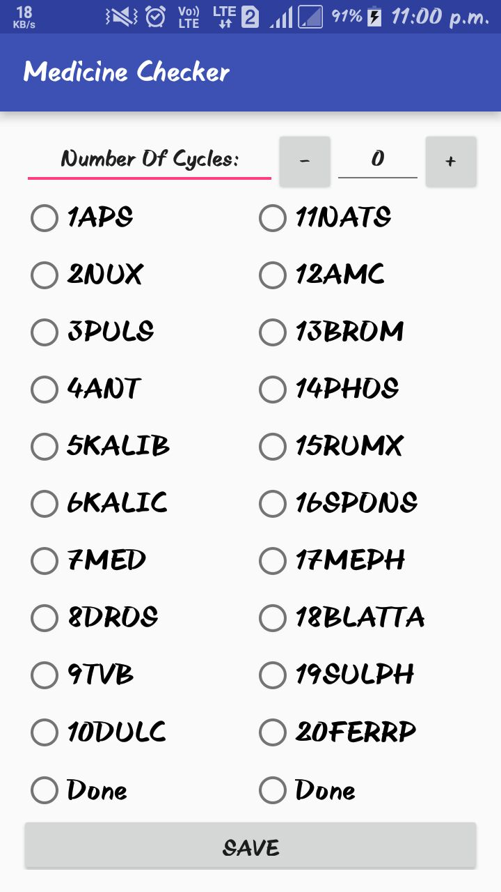
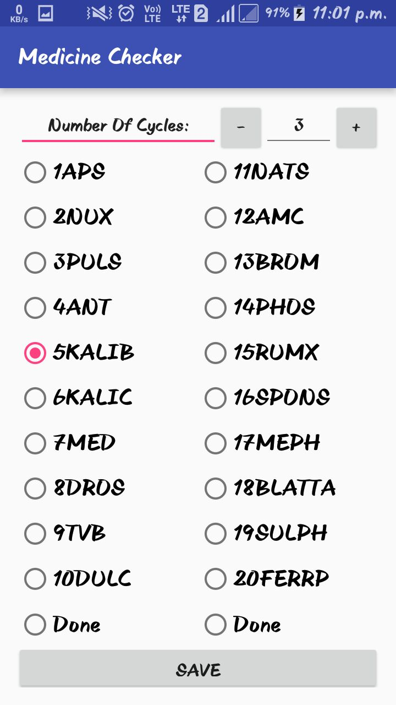

# MedicineChecker
<ul><b>A very useful medication tracker</b>
<li>There are medications in which we are given 20-25 containers. The medication is such that we need to take 8 small pills from one 
container every two hours. Therefore after 2 hours we have to take 8 pills from the next container. </li>
<li>This app makes it easy to track which medicine you had taken previously and also helps to keep a count of the cycles. 
You don't have to note down these details in some book/notes. 
A simple medicine checker app is all that you need.</li>
</ul>

 

